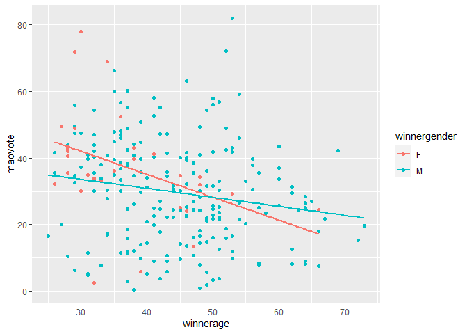

<!-- README.md is generated from README.Rmd. Please edit that file -->

# Nepal-Conflict-and-Elections

<!-- badges: start -->
<!-- badges: end -->

## Introduction

Nepal is one of only a few countries in the world that successfully
integrated a rebel group into its political system, a process that has
yielded relatively peaceful results to the present day. From 1996 to
2006, the Nepalese people experienced the tragedy and wholesale
destruction of a [civil
war](https://en.wikipedia.org/wiki/Nepalese_Civil_War) that destroyed
lives, communities and families alike. For the personal stories of those
affected, the [INSEC](https://www.insec.org.np/victim) database
comprehensively catalogues details on the thousands of dead, wounded and
missing of the conflict.

Given Nepal’s unique story, I put together a study to examine the
relationship between a rebel group’s actions during a civil conflict
(regarding their treatment of civilians and casualties inflicted on
government forces), and its performance in postwar transitional
elections.

## The data

Here is a subsection of the dataset I compiled. There is also data on
Maoist electoral performance, and some attributes of the successful and
unsuccessful candidates who contested the single-member constituencies.

``` r
library(tidyverse)
library(kableExtra)

df = read.csv("completedata.csv")
kable(head(df))
```

| districtname | constnum | constname      | maovote | civdeath_gov | civdeath_mao | govtdeath | maodeath | statebased | onesided | turnout | candidate_avgage | winnerage | per_femalecandidates | per_malecandidates | winnergender |
|:-------------|---------:|:---------------|--------:|-------------:|-------------:|----------:|---------:|-----------:|---------:|--------:|-----------------:|----------:|---------------------:|-------------------:|:-------------|
| Achham       |        1 | Achham 1       |   31.09 |         0.00 |         0.00 |      0.00 |     0.00 |       0.00 |     0.00 |   54.53 |            40.57 |        40 |                 0.00 |             100.00 | M            |
| Achham       |        2 | Achham 2       |   35.56 |         6.27 |         8.36 |    138.97 |    76.27 |      14.63 |   215.24 |   52.82 |            45.50 |        32 |                 0.00 |             100.00 | M            |
| Arghakhanchi |        1 | Arghakhanchi 1 |   40.20 |         0.00 |         0.00 |      0.00 |     0.00 |       0.00 |     0.00 |   55.34 |            44.75 |        46 |                12.50 |              87.50 | M            |
| Arghakhanchi |        2 | Arghakhanchi 2 |   24.03 |        16.19 |         8.63 |     62.59 |    87.42 |      24.82 |   150.01 |   52.05 |            44.33 |        46 |                16.67 |              83.33 | F            |
| Baglung      |        1 | Baglung 1      |   30.12 |         0.00 |         0.00 |      0.00 |     0.00 |       0.00 |     0.00 |   60.01 |            46.70 |        48 |                10.00 |              90.00 | M            |
| Baglung      |        2 | Baglung 2      |   17.98 |         0.00 |         0.00 |      0.00 |     0.00 |       0.00 |     0.00 |   55.29 |            47.00 |        66 |                10.00 |              90.00 | M            |

## Descriptive statistics

With this data, we can examine the mean age of candidates and winning
candidates in each electoral district along with concurrent violence
statistics.

``` r
mean(df$winnerage)
#> [1] 43.725
mean(df$candidate_avgage)
#> [1] 44.46258
mean(df$civdeath_gov)
#> [1] 4.54925
mean(df$civdeath_mao)
#> [1] 5.957208
mean(df$govtdeath)
#> [1] 10.75725
mean(df$maodeath)
#> [1] 24.28762
mean(df$statebased)
#> [1] 10.50646
mean(df$onesided)
#> [1] 35.04487
```

## Plots

We can visualize how the age of winning candidates moves with gender and
the Maoist vote share in each electoral district.

``` r
ggplot(df, aes(maovote, winnerage, colour = winnergender)) + 
  geom_point() + 
  geom_smooth(method=lm, se=FALSE)
```

<!-- -->
