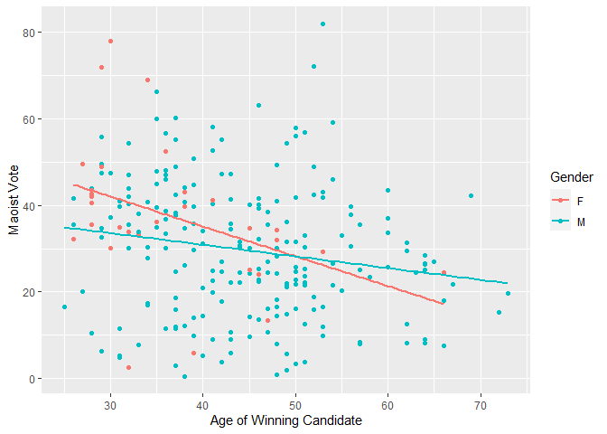
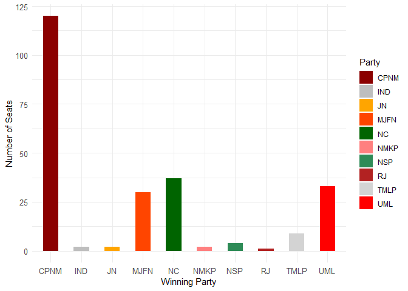

<!-- README.md is generated from README.Rmd. Please edit that file -->

# Nepal-Conflict-and-Elections

<!-- badges: start -->
<!-- badges: end -->

## Introduction

Nepal is one of only a few countries in the world that successfully
integrated a rebel group into its political system, a process that has
yielded relatively peaceful results to the present day. From 1996 to
2006, the Nepalese people faced the tragedy of a [civil
war](https://en.wikipedia.org/wiki/Nepalese_Civil_War) that destroyed
lives, communities and families alike. For the personal stories of those
affected, the [INSEC](https://www.insec.org.np/victim) database
comprehensively catalogues details on the thousands of dead, wounded and
missing of the conflict.

Given Nepal’s unique story, I put together a study to examine the
relationship between a rebel group’s actions during a civil conflict
(regarding their treatment of civilians and casualties inflicted on
government forces), and its performance in postwar transitional
elections.

## The data

Here is a subsection of the dataset I compiled. There is also data on
Maoist electoral performance, and some attributes of the successful and
unsuccessful candidates who contested the single-member constituencies.

``` r
library(tidyverse)
library(kableExtra)

df = read.csv("completedata.csv")
kable(head(df))
```

| districtname | constnum | constname      | maovote | civdeath_gov | civdeath_mao | govtdeath | maodeath | statebased | onesided | turnout | candidate_avgage | winnerage | per_femalecandidates | per_malecandidates | winnergender |
|:-------------|---------:|:---------------|--------:|-------------:|-------------:|----------:|---------:|-----------:|---------:|--------:|-----------------:|----------:|---------------------:|-------------------:|:-------------|
| Achham       |        1 | Achham 1       |   31.09 |         0.00 |         0.00 |      0.00 |     0.00 |       0.00 |     0.00 |   54.53 |            40.57 |        40 |                 0.00 |             100.00 | M            |
| Achham       |        2 | Achham 2       |   35.56 |         6.27 |         8.36 |    138.97 |    76.27 |      14.63 |   215.24 |   52.82 |            45.50 |        32 |                 0.00 |             100.00 | M            |
| Arghakhanchi |        1 | Arghakhanchi 1 |   40.20 |         0.00 |         0.00 |      0.00 |     0.00 |       0.00 |     0.00 |   55.34 |            44.75 |        46 |                12.50 |              87.50 | M            |
| Arghakhanchi |        2 | Arghakhanchi 2 |   24.03 |        16.19 |         8.63 |     62.59 |    87.42 |      24.82 |   150.01 |   52.05 |            44.33 |        46 |                16.67 |              83.33 | F            |
| Baglung      |        1 | Baglung 1      |   30.12 |         0.00 |         0.00 |      0.00 |     0.00 |       0.00 |     0.00 |   60.01 |            46.70 |        48 |                10.00 |              90.00 | M            |
| Baglung      |        2 | Baglung 2      |   17.98 |         0.00 |         0.00 |      0.00 |     0.00 |       0.00 |     0.00 |   55.29 |            47.00 |        66 |                10.00 |              90.00 | M            |

## Descriptive statistics

With this data, we can examine the mean age of candidates and winning
candidates in each electoral district along with concurrent violence
statistics.

``` r
mean(df$winnerage)
#> [1] 43.725
mean(df$candidate_avgage)
#> [1] 44.46258
mean(df$civdeath_gov)
#> [1] 4.54925
mean(df$civdeath_mao)
#> [1] 5.957208
mean(df$govtdeath)
#> [1] 10.75725
mean(df$maodeath)
#> [1] 24.28762
mean(df$statebased)
#> [1] 10.50646
mean(df$onesided)
#> [1] 35.04487
```

## Plots

We can visualize how the age of winning candidates moves with gender and
the Maoist vote share in each electoral district.

``` r
ggplot(df, aes(maovote, winnerage, colour = winnergender)) + 
  geom_point() + 
  geom_smooth(method=lm, se=FALSE)
```

<!-- -->

This plot regresses turnout with the average age of the winning
candidate separated by gender. We can see that there is a much stronger
positive relationship between turnout and winner age in constituencies
with female winning candidates as a pose to male candidates.

``` r
ggplot(df, aes(turnout, winnerage, colour = winnergender)) + 
  geom_point() + 
  geom_smooth(method=lm, se=FALSE)
```

<!-- -->

This plot regresses Maoist performance with the average age of the
candidates contesting single-member constituencies disaggregated by
gender.

``` r
ggplot(df, aes(maovote, candidate_avgage, colour = winnergender)) + 
  geom_point() + 
  geom_smooth(method=lm, se=FALSE)
```

<!-- -->

Now, moving onto regressions that involve conflict statistics. My
study’s main hypothesis argued that there should be a negative
association between the level of atrocities the Maoists committed and
their electoral performance, and a positive association between the
casualty rate inflicted on government forces and Maoist electoral
performance.

## Gender in the Nepalese Civil War

A topic I did not adequately touch on in my thesis was the the prominent
role played by women cadre and fighters in the Maoist movement. Let’s
examine some trends of violence and Maoist electoral performance through
the lens of the gender of the winning candidates. A general trend across
all of the predictor variables was the inherently stronger support for
the CPN(M) in the constituencies won by women.

In this first chart, we can see that the few constituencies with female
winning candidates generally had greater Maoist support, but that there
is a more positive relationship between Maoist atrocities and Maoist
electoral performance in electoral districts where the winning
candidates were women.

``` r
ggplot(df, aes(civdeath_mao, maovote, colour = winnergender)) + 
  geom_point() + 
  geom_smooth(method=lm, se=FALSE)
```

<!-- -->

By contrast, when studying the effect of civilian deaths caused by
government forces on Maoist electoral performance, the differences by
gender of the winning candidate are far more drastic.

``` r
ggplot(df, aes(civdeath_gov, maovote, colour = winnergender)) + 
  geom_point() + 
  geom_smooth(method=lm, se=FALSE)
```

<!-- -->

We can see that the Maoist vote share increased markedly along with the
death rate of government forces. In addition to the generally higher
Maoist vote shares in constituencies won by women, it is again
noticeable that the rebel vote share increased by more in these
electoral districts relative to the male ones.

``` r
ggplot(df, aes(govtdeath, maovote, colour = winnergender)) + 
  geom_point() + 
  geom_smooth(method=lm, se=FALSE)
```

<!-- -->

Here is the relationship between rebel deaths and rebel vote share in
the 2008 elections. In this case, the slope of the regression line for
constituencies with male winners is steeper than the regression for the
few constituencies where women were elected

``` r
ggplot(df, aes(maodeath, maovote, colour = winnergender)) + 
  geom_point() + 
  geom_smooth(method=lm, se=FALSE)
```

<!-- -->

Finally, an examination of turnout and Maoist support. It is noted by
election observers like the Carter Center, that the Maoists engaged in
intimidation and harassment in the leadup to the polls, but that the
election itself took place in reasonably tranquil conditions. Here, we
can see that regardless of gender, the Maoists performed better in
electoral districts where fewer eligible voters turned out. Once again,
the general effect is even more pronounced in constituencies where women
were victorious.

``` r
ggplot(df, aes(turnout, maovote, colour = winnergender)) + 
  geom_point() + 
  geom_smooth(method=lm, se=FALSE)
```

<!-- -->
