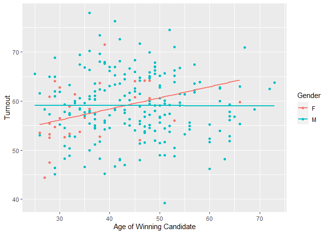
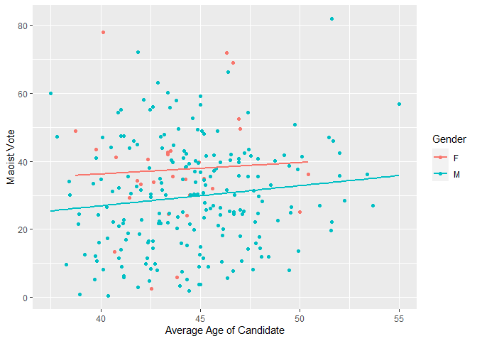
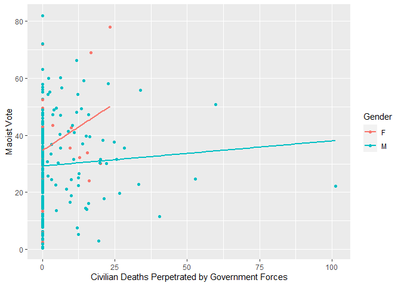

<!-- README.md is generated from README.Rmd. Please edit that file -->

# Nepal-Conflict-and-Elections

<!-- badges: start -->
<!-- badges: end -->

## Introduction

Nepal is one of only a few countries in the world that successfully
integrated a rebel group into its political system, a process that has
yielded relatively peaceful results to the present day. From 1996 to
2006, the Nepalese people faced the tragedy of a [civil
war](https://en.wikipedia.org/wiki/Nepalese_Civil_War) that destroyed
lives, communities and families alike. For the personal stories of those
affected, the [INSEC](https://www.insec.org.np/victim) database
comprehensively catalogues details on the thousands of dead, wounded and
missing of the conflict.

Given Nepal’s unique story, I put together a study to examine the
relationship between a rebel group’s actions during a civil conflict
(regarding their treatment of civilians and casualties inflicted on
government forces), and its performance in postwar transitional
elections.

## The data

Here is a subsection of the dataset I compiled. There is also data on
Maoist electoral performance, and some attributes of the successful and
unsuccessful candidates who contested the single-member constituencies.

``` r
library(tidyverse)
library(kableExtra)
library(psych)

df = read.csv("completedata.csv")
kable(head(df))
```

| districtname | constnum | constname      | maovote | civdeath_gov | civdeath_mao | govtdeath | maodeath | statebased | onesided | turnout | candidate_avgage | winnerage | per_femalecandidates | per_malecandidates | winnergender | winningparty |
|:-------------|---------:|:---------------|--------:|-------------:|-------------:|----------:|---------:|-----------:|---------:|--------:|-----------------:|----------:|---------------------:|-------------------:|:-------------|:-------------|
| Achham       |        1 | Achham 1       |   31.09 |         0.00 |         0.00 |      0.00 |     0.00 |       0.00 |     0.00 |   54.53 |            40.57 |        40 |                 0.00 |             100.00 | M            | UML          |
| Achham       |        2 | Achham 2       |   35.56 |         6.27 |         8.36 |    138.97 |    76.27 |      14.63 |   215.24 |   52.82 |            45.50 |        32 |                 0.00 |             100.00 | M            | CPNM         |
| Arghakhanchi |        1 | Arghakhanchi 1 |   40.20 |         0.00 |         0.00 |      0.00 |     0.00 |       0.00 |     0.00 |   55.34 |            44.75 |        46 |                12.50 |              87.50 | M            | CPNM         |
| Arghakhanchi |        2 | Arghakhanchi 2 |   24.03 |        16.19 |         8.63 |     62.59 |    87.42 |      24.82 |   150.01 |   52.05 |            44.33 |        46 |                16.67 |              83.33 | F            | NC           |
| Baglung      |        1 | Baglung 1      |   30.12 |         0.00 |         0.00 |      0.00 |     0.00 |       0.00 |     0.00 |   60.01 |            46.70 |        48 |                10.00 |              90.00 | M            | UML          |
| Baglung      |        2 | Baglung 2      |   17.98 |         0.00 |         0.00 |      0.00 |     0.00 |       0.00 |     0.00 |   55.29 |            47.00 |        66 |                10.00 |              90.00 | M            | RJ           |

## Descriptive statistics

With this data, we can examine the mean age of winning candidates in
each electoral district along with the mean level of civilian killed by
Maoists per 100,000 eligible voters and the mean level of Maoist rebels
killed by government forces per 100,000 eligible voters.

``` r

df %>% summarise(civdeath_mao = mean(df$civdeath_mao), maodeath = mean(df$maodeath), winnerage = mean(df$winnerage))%>% tibble()
#> # A tibble: 1 × 3
#>   civdeath_mao maodeath winnerage
#>          <dbl>    <dbl>     <dbl>
#> 1         5.96     24.3      43.7
```

Key

civdeath_gov -\> Civilian deaths perpetrated by Government Forces (Royal
Nepalese Army, Nepal Police, Armed Police Force) per 100,000 eligible
voters

civdeath_mao -\> Civilian deaths perpetrated by the Communist Party of
Nepal (Maoist) per 100,000 eligible voters

govtdeath -\> Government deaths perpetrated by the Maoist rebels per
100,000 eligible voters

maodeath -\> Maoist deaths perpetrated by Government forces per 100,000
eligible voters.

statebased -\> State-based deaths (govtdeath + maodeath) per 100,000
eligible voters.

onesided -\> One-sided deaths (civdeath_gov + civdeath_mao) per 100,000
eligible voters.

## Plots

We can visualize how the Maoist vote share moves with gender and the age
of the winning candidate in each electoral district.

``` r
ggplot(df, aes(winnerage, maovote, colour = winnergender)) + 
  geom_point() +  
  geom_smooth(method=lm, se=FALSE) + labs(x = "Age of Winning Candidate", y = "Maoist Vote", color = "Gender")
```

<!-- -->

This plot visualizes the relationship between the average age of the
winning candidate and voter turnout separated by gender. We can see that
there is a much stronger positive relationship between winner age and
turnout in constituencies with female winning candidates as a pose to
electoral districts with male winners.

``` r
ggplot(df, aes(winnerage, turnout, colour = winnergender)) + 
  geom_point() + 
  geom_smooth(method=lm, se=FALSE) + labs(x = "Age of Winning Candidate", y = "Turnout", color = "Gender")
```

<!-- -->

This plot depicts the association between the average age of the
candidates contesting the single-member constituencies in the 2008
elections and the Maoist vote share. On average, as the average age of
the candidates increased,the Maoist vote share in the electoral
districts increased at a roughly similar rate in constituencies won by
men and women.

``` r
ggplot(df, aes(candidate_avgage, maovote, colour = winnergender)) + 
  geom_point() + 
  geom_smooth(method=lm, se=FALSE) + labs(x = "Average Age of Candidate", y = "Maoist Vote", color = "Gender")
```

<!-- -->

## Gender in the Nepalese Civil War

A topic I did not adequately touch on in my thesis was the the prominent
role played by women cadre and fighters in the Maoist movement. Based on
the data, one-eighth of the winning candidates in the electoral
districts were women.

``` r
ggplot(df, aes(winnergender, fill=winnergender)) + 
  geom_bar(width = 0.5) + theme_minimal() + labs(x = "Gender of Winning Candidates", y = "Number of Winning Candidates", fill = "Gender")
```

<!-- -->

Let’s examine some trends related to violence and Maoist electoral
performance through the lens of the gender of the winning candidates. An
observation that holds across all of the predictor variables was the
inherently stronger support for the CPN(M) in the constituencies won by
women. When observing the effect of civilian atrocities perpetrated by
government forces on support for the Maoists in the 2008 elections,
something distinct stands out. On average, it appears that the electoral
districts with female winning candidates had less violence to begin
with, but voted for the Maoist candidate in greater numbers. However, in
spite of the small sample size, we can observe that there exists a much
more positive association between government violence and Maoist
electoral success in constituencies won by women compared to those won
by men.

``` r
ggplot(df, aes(civdeath_gov, maovote, colour = winnergender)) + 
  geom_point() + 
  geom_smooth(method=lm, se=FALSE) + labs(x = "Civilian Deaths Perpetrated by Government Forces", y = "Maoist Vote", color = "Gender")
```

<!-- -->

It is also prudent to observe the relationship between turnout and
Maoist support. Election observers like the Carter Center noted that the
Maoists engaged in the intimidation and harassment of their opponents in
the days leading up to the polls, but that the election itself took
place in reasonably tranquil conditions. Here, we can see that
regardless of gender, the Maoists performed better in electoral
districts where fewer eligible voters turned out. There appears to be a
stronger negative relationship between turnout and Maoist electoral
performance for constituencies where women were victorious versus those
won by male candidates.

``` r
ggplot(df, aes(turnout, maovote, colour = winnergender)) + 
  geom_point() + 
  geom_smooth(method=lm, se=FALSE) + labs(x = "Turnout", y = "Maoist Vote", color = "Gender")
```

<!-- -->

## Political Parties in the 2008 Constituent Assembly Election

``` r
ggplot(df, aes(x = winningparty, fill=winningparty)) + 
  geom_bar(width = 0.5) + theme_minimal() +
  scale_fill_manual(values = c("darkred", "grey", "orange", "orangered", "darkgreen" , "#ff8080" , "seagreen" , "firebrick" , "lightgrey" , "red"))+ 
  theme(axis.text=element_text(size=10)) + labs(x = "Winning Party", y = "Number of Seats", fill = "Party")
```

<!-- -->


    Let's calculate the effective number of parties per electoral district. 


    ```r

    df2 <- read.csv("partylistresults.csv")

    # Extract the relevant columns containing the p values
    p_values <- df2[, -(1:4)]  # Assuming the first column contains row identifiers, adjust if needed

    # Function to calculate N for each row
    calculate_N <- function(row) {
      sum_squares <- sum(row^2)
      N <- 1 / sum_squares
      return(N)
    }

    # Calculate N for each row
    N_values <- apply(p_values, 1, calculate_N)

    # Add N values to the original data frame
    df2 <- cbind(df2[, 4], N = N_values)

    # Print or export the resulting data frame with N values
    kable(head(df2))

|                | N                |
|:---------------|:-----------------|
| Achham 1       | 3.29844088636495 |
| Achham 2       | 4.37112742697562 |
| Arghakhanchi 1 | 4.24272583594745 |
| Arghakhanchi 2 | 3.73611058857453 |
| Baglung 1      | 4.21100078476211 |
| Baglung 2      | 4.77776238276566 |

Here is a chart that regresses turnout in the constituent assembly
election and the effective number of parties per electoral district,
disaggregated by gender.

``` r
df3 <- read.csv("partylistresults.csv")
df3$N <- N_values
df4 <- read.csv("completedata.csv")

ggplot(df3, aes(df4$turnout, N, colour = df4$winnergender)) + 
  geom_point() + 
  geom_smooth(method=lm, se=FALSE) +
  theme(axis.text = element_text(size = 6)) + labs(title = "Effective Number of Parties and Turnout" , x = "Turnout" , y = "Effective Number of Parties", color = "Gender")
```

<!-- -->

\`\`\`
